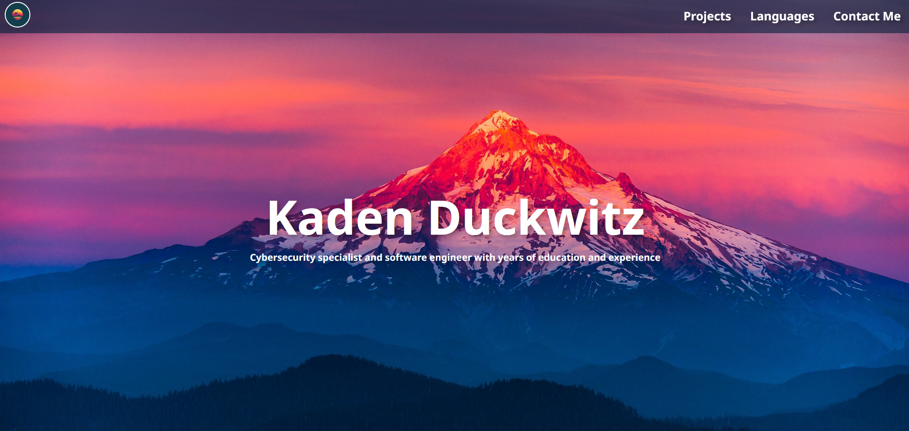

<h1 align="center">My Website - An Overview of My Career</h1>

🌐 This website was written <b>entirely</b> from scratch, and is a nice way to showcase what I know, what I can do, 
  and what projects I've worked on. If you're looking to contact me and request a project, this is also a good way to do that! 🌐

  <a href="">View the site here!</a>

<h1 align="center">Site Preview</h1>

<h1 align="center">Site Features</h1>

<ul>
  <li><b>Project List</b> - A full list of projects that I've had a major role in - these can also be found here on GitHub</li>
  <li><b>Language List</b> - A full list of programming languages that I've worked with</li>
  <li><b>Contact Me</b> - An easy way to contact me - this is highly recommended if you are requesting a project</li>
</ul>
